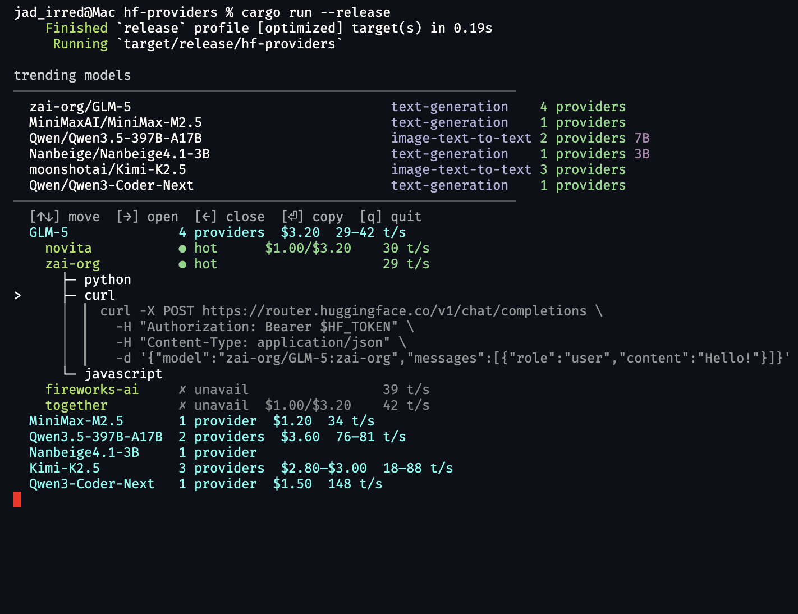

# hf-providers

Find out how to run any Hugging Face model -- compare providers, pricing, throughput, and get ready-to-use code snippets.


## Install

```
brew install jadnohra/tap/hf-providers
```

Or build from source:

```
cargo install --git https://github.com/jadnohra/hf-providers
```

## Usage

```
# Search for a model (opens interactive browser)
hf-providers deepseek-r1

# Quick code snippet via a specific provider
hf-providers deepseek-r1@novita

# Specify language
hf-providers deepseek-r1@novita:curl
hf-providers deepseek-r1@novita:js

# Get the cheapest option directly
hf-providers run deepseek-r1 --cheapest

# Browse a provider's models
hf-providers providers groq

# List all providers
hf-providers providers

# Live status with auto-refresh
hf-providers status deepseek-r1 --watch 5

# Trending models (default, no args)
hf-providers
```

## Interactive browser

When run in a terminal, `hf-providers` opens an interactive tree browser:

- Arrow keys or `hjkl` to navigate
- Right arrow expands models into providers, providers into languages
- Code snippets auto-expand when you land on a language
- `c` or Enter copies the visible snippet to clipboard
- `q` to quit




## Authentication

Set `HF_TOKEN` or `HUGGING_FACE_HUB_TOKEN`, or log in with `huggingface-cli login`. The token is read automatically from `~/.cache/huggingface/token`.

A token is optional but recommended -- authenticated requests get higher rate limits and access to gated models.

## Providers

Data comes live from the Hugging Face Inference API. Currently tracked providers:

Cerebras, Cohere, fal, Featherless, Fireworks, Groq, Hyperbolic, Nebius, Novita, Nscale, OVHcloud, Public AI, Replicate, SambaNova, Scaleway, Together AI, WaveSpeed, Z.ai, HF Inference

## License

MIT OR Apache-2.0
